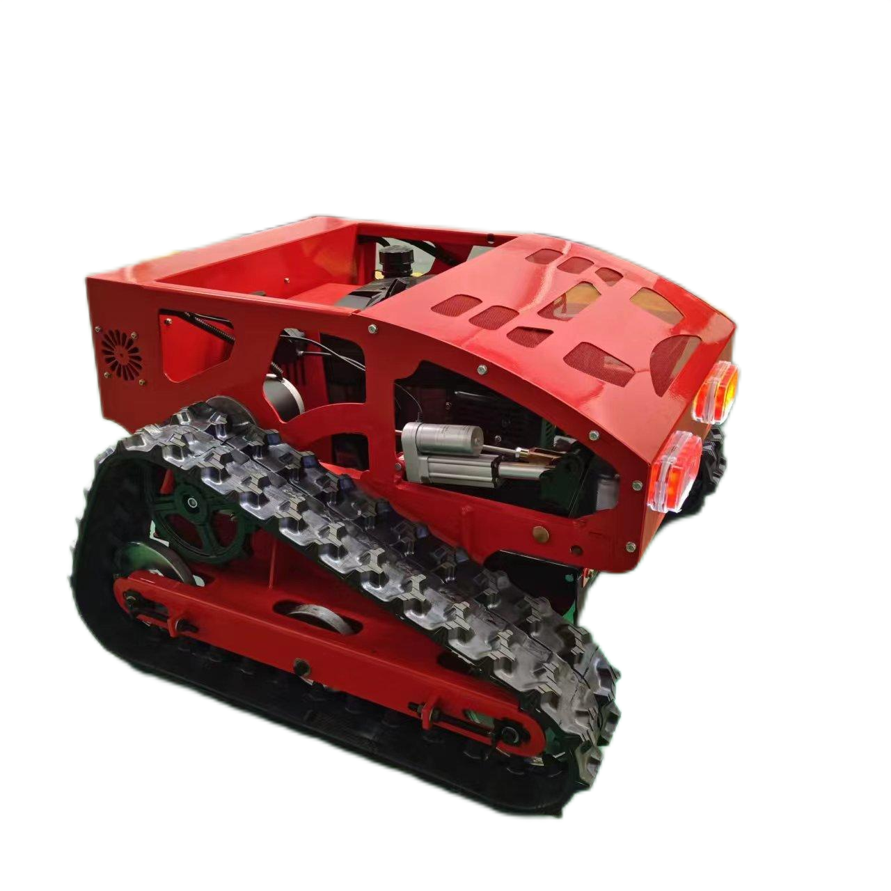

# ROBOTMOWER

**Tracked mower → Remote-capable robotic platform (safety-first, web-controlled, sensor-ready).**

> Goal: upgrade a basic RC tracked mower into a modern robotic system with
> safe PWM control, onboard compute, live video, and a self-hosted web UI — with a path to full remote operations.

---

## What this project is
This repo documents the **hardware + software upgrade** of a tracked mower into a modular robotics platform.

### Core capabilities (target)
- **Local web control UI** (connect directly to mower Wi-Fi / AP)
- **PWM motor control** for left track / right track / deck lift actuator
- **Safety system**: arm/disarm, watchdog timeout, E-stop, safe defaults
- **Live video** (USB camera on Raspberry Pi or edge compute module)
- **Expandable sensor stack**: IMU, GPS, distance sensors, beacons, telemetry

---

**Near-term architecture (Phase 1):**
- **ESP32**: real-time PWM generation, safety watchdog, failsafe behavior
- **Raspberry Pi (optional early / primary later):** web UI host + video streaming + telemetry aggregation
- **Power**: 12V battery → fused distribution → motor drivers + logic rails

---

## Hardware (current)
- Tracked mower base platform
- 12V battery power system
- Motor drivers (left/right tracks) + lift actuator control
- Receiver bay / electronics bay (being replaced by integrated control stack)

📸 Photos:
- `Images/mower_top.jpg`
- `Images/electronics_bay.jpg`

---

## Roadmap
### Phase 1 — Prototype
**Objective:** reliable, safe local-control system for real testing.
- [ ] Integrated controller enclosure (clean mounting + cable management)
- [ ] Web UI: sliders for left/right tracks + lift control
- [ ] Arm/Disarm + indicator (LED/beacon)
- [ ] Watchdog + comms timeout → stop motors
- [ ] Hard E-stop wiring + documented safe state
- [ ] Live video stream (USB cam)
- [ ] Data logging (commands + timestamps)

### Phase 2 — Expanded Capability Stack
- [ ] IMU + orientation view
- [ ] Add distance sensors front/rear
- [ ] Pixhawk integration (GPS + mission planning)
- [ ] Remote operations architecture (relay, VPN, or cellular gateway)

### Phase 3 — Autonomy + Remote Ops
- [ ] Autonomy stack integration (route planning + geofencing)
- [ ] Operator tools: health checks, alerts, return-to-safe behavior
- [ ] Field-ready reliability improvements

---

## Safety

- Always boot into a **disabled** state.
- Loss of UI/control link must trigger **stop** within a short timeout.
- E-stop must remove drive power **independently of software**.
- Test phases are **human-supervised** until verified safe.

See: `Docs/Safety.md`
